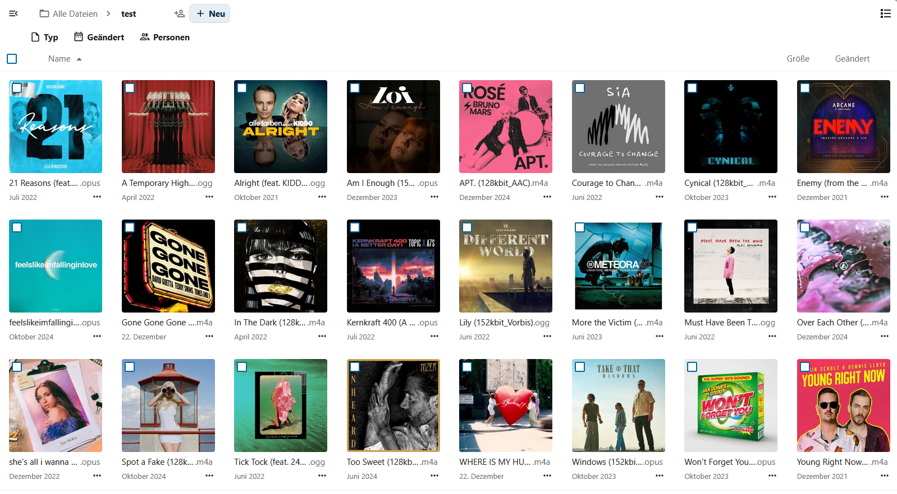

# Audio File Preview Generation for Nextcloud


A very basic app to generate preview images of album covers for multiple music formats that Nextcloud currently doesn't support previews for.

> [!WARNING]
> This is my first development with Nextcloud and ffmpeg. The App is in early alpha Stage. It works on my dev system and in the nextcloud on my server. However there are probably still use cases wher it won't work.
> Usage is at your own risk. It is recommended to backup your DB and preview files before installing the app.


Generate preview images for more audio formats. This Nextcloud app generates preview images of album covers with ffmpeg. The previews will be shwon in the file list after generation.

For now the following audio formats are supported:
 - M4A
 - OPUS
 - OGG
 - FLAC
 - MP3 (Nextclouds default provider seems to have a lot of issues with my files)

More formats might be supported in the future.
Currently the preview images are saved as jpg.

## Usage

To use the app you need ffmpeg installed on your server. For me it worked best by installing it via apt (sudo apt install ffmpeg)
Also the app tests if the binary exists using which. You should make sure this points to the right file (should be /usr/bin/ffmpeg).

Imagemagick is optional. In my case ffmpeg is generating wrong markers into the output. PHP gd will refuse tho read the files in that case. To fix it currently I use imagemagick to convert the file into jpeg and fix the wrong marker. If you don't have imagemagick installed these previews won't be available.

Since 0.10: Imagemagick can also be used to re-encode the ffmpeg output to another format. For now jpg,png,webp are supported options.
The list is limited for now since both nextcloud and php-gd have to support the specified format. It might be expanded with more formats in later versions.
The format can be set with the following command:

```
occ config:app:set --value=<format> audiocoverpreview image_format
```

## Issues

Since 0.10 the app comes with a settings page that dispalys some infos about the detected ffmpeg and imagemagick configuration.
If you have an issue you should check that first. It can also be helpful to include some of that information in your issue
description for easier troubleshooting.

If you have a problem you can create an issue. To make it easier for others to help you out post the following info:
 1. If you see a log entry, post the full entry.
 2. Write what System you are using (OS, ffmpeg Version) as this can be the issue
 3. Describe how excactly the issue can be reporduced

## Some answers to questions you might have

### The selection of supported formats seems random. Why is that?

  This is because I currently only included the mix of audio formats that I have in my music library.
  
### I want support for format x
 
 You can open an issue for that. How likely it is that your format will be added depends espacially on if ffmpeg is able to handle it like the other formats.
 Ideally you can link a freely usable file in your desired format that can be used for testing.