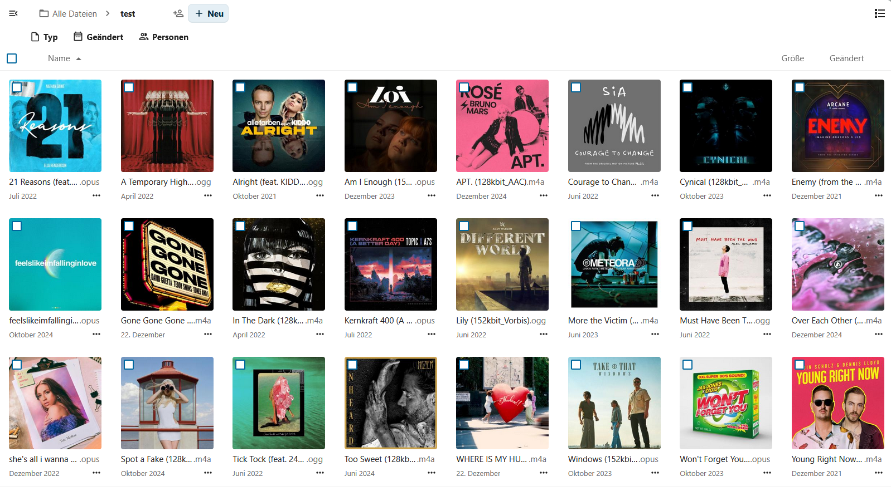

# Audio File Preview Generation for Nextcloud


A very basic app to generate preview images of album covers for multiple music formats that Nextcloud currently doesn't support previews for.

> [!WARNING]
> This is my first development with Nextcloud and ffmpeg. The App has not been extensively tested. It works on my dev system and in the nextcloud on my server. However there are probably still use cases where it won't work.
> Usage is at your own risk. It is recommended to backup your DB and preview files before installing the app.


Generate preview images for more audio formats. This Nextcloud app generates preview images of album covers with ffmpeg. The previews will be shwon in the file list after generation.

For now the following audio formats are supported:
 - M4A
 - OPUS
 - OGG
 - FLAC
 - MP3 (the default provider seems to have issues with my files sometimes)

More formats might be supported in the future.

## How it works
The app registers a preview provider for each supported format. When a preivew of one of the supported formats is requested the preview providers of this app are called (They all use the same underlying code.). The provider will use the ffmpeg binary to extract the album preview image. After that a temporary file with the image will be created in /tmp/.

If the image is detected as broken or a different format is requested in the settings, imagemagick will be used next to convert or re-encode. This will only happen if Imagemagick is installed and found by the app.

After that the image is loaded by using the loadFromFile from the image object. Then the temporary file is deleted and the image is returned. If something went wrong the provider will return null which will result in the default preview image being shown in the frontend.

## Usage
To use the app you need ffmpeg installed on your server. For me it worked best by installing it via apt (sudo apt install ffmpeg)
Also the app tests if the binary exists using which. You should make sure this points to the right file (should be /usr/bin/ffmpeg).

Imagemagick is optional. In my case ffmpeg is sometimes generating wrong markers into the output. php-gd will refuse to read the files in that case. To fix it currently I use imagemagick to re-encode the file again and fix the wrong marker. If you don't have imagemagick installed these previews won't be available.

Imagemagick can also be used to convert the ffmpeg output to another format. For now jpg, png and webp are supported options.
The list is limited for now since both nextcloud and php-gd have to support the specified format. It might be expanded with more formats in later versions.
The format can be set with the following command:

```
occ config:app:set --value=<format> audiocoverpreview image_format
```

## Advanced Usage
To get a bit more performance by not checking the envoirnment for every generation/preview fetching a setting skip_checks was introduced. This disables checking eg. for ffmpeg and imagemagick formats. If the extension is set up correctly and works
you might consider turning it on. Keep in mind that those checks will be off until you reset the setting. The admin settings
page is not affected by the change and will still run the checks for giving the correct status.
The setting can be set by the following command:

```
occ config:app:set --value=<true|false> audiocoverpreview skip_checks
```

## Issues

If you have a problem you can create an issue.
The app comes with a settings page that dispalys some information about the detected ffmpeg and imagemagick configuration.
If you have an issue you should check that first. It can also be helpful to include some of that information in your issue
description for easier troubleshooting.

To make it easier for others to help you post the following info:
 1. If you see a log entry, post the full entry.
 2. Write what System you are using (OS, ffmpeg Version) as this can be the issue.
 3. Include the relevant Information from the 'Audiocover Cover Preview Settings' page int the admin settings section
 4. Describe how the issue can be reporduced.


## Some answers to questions you might have

### The selection of supported formats seems random. Why is that?

  This is because I currently only included the mix of audio formats that I have in my music library.
  
### I want support for format x
 
 You can open an issue for that. How likely it is that your format will be added depends espacially on if ffmpeg is able to handle it like the other formats.
 Ideally you can link a freely usable file in your desired format that can be used for testing.